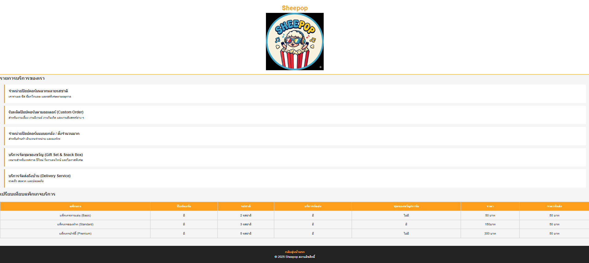
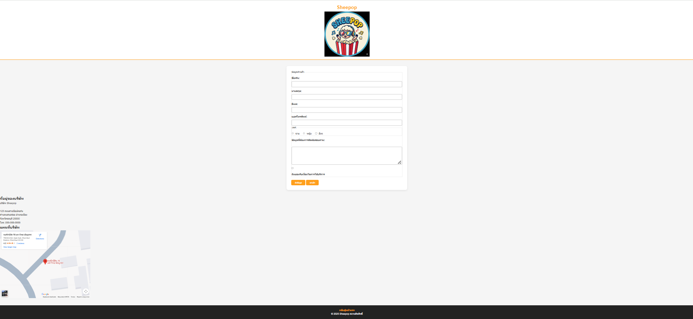

# Sheepop Co., Ltd. – เว็บไซต์ร้านขายป๊อปคอร์น

เว็บไซต์จำลองของ **Sheepop Co., Ltd..**
เป็นเว็บไซต์การซื้อป๊อปคอร์น ที่มีให้เลือกรสชาติ การจัดส่ง Package

## ข้อมูล Assignment#1

เว็บไซต์นี้ประกอบด้วย 4 หน้าหลัก ได้แก่ หน้าแรก, เกี่ยวกับเรา, บริการ, และติดต่อเรา

## โครงสร้างไฟล์

- index.html : หน้าแรก (Home)
- about.html : หน้าเกี่ยวกับเรา (About Us)
- services.html : หน้าบริการ (Services)
- contact.html : หน้าติดต่อเรา (Contact)
- images/ : โฟลเดอร์เก็บรูปภาพ (logo.png, CEO.jpg, MD.jpg)
- screenshots/ : โฟลเดอร์เก็บรูปภาพหน้าจอ
- README.md : เอกสารประกอบโปรเจกต์

## สิ่งที่พัฒนาเพิ่มเติมใน Web

### 1. Reset & พื้นฐานของหน้าเว็บ

- รีเซ็ต margin, padding, box-sizing
- กำหนดฟอนต์ สีพื้นหลัง และ line-height ของ body
- กำหนดให้รูปภาพไม่ล้น container (max-width: 100%)

### 2. Header และ Navigation (ใช้ Flexbox)

- จัด header เป็นแนวตั้ง (flex-direction: column)
- จัดเนื้อหาให้อยู่กึ่งกลาง
- เพิ่มเส้นขอบล่างสีส้ม
- เมนูนำทางเรียงแนวนอนและมี hover effect

### 3. Hero Section

- เพิ่ม section ต้อนรับหน้าแรก
- ใช้พื้นหลังสีส้ม ตัวอักษรสีขาว
- ปรับขนาดหัวข้อให้เด่น

### 4. Featured Services (Flexbox)

- ใช้ Flexbox จัดบริการหลายกล่อง
- เพิ่มช่องว่างระหว่างกล่อง
- เพิ่ม hover effect เปลี่ยนสีพื้นหลัง

### 5. Team Section (Grid Layout)

- ใช้ CSS Grid จัดทีมงานอัตโนมัติตามขนาดหน้าจอ
- จัดการ์ดทีมงานเป็นกล่อง มีมุมโค้ง
- จัดข้อความให้อยู่กึ่งกลาง

### 6. Services Page Style

- เพิ่มกรอบด้านซ้ายสีส้มให้แต่ละบริการ
- แยกบริการเป็น block ชัดเจน

### 7. Table Styling

- ตารางเต็มความกว้าง
- รวมเส้นขอบ (border-collapse)
- หัวตารางพื้นหลังสีส้ม ตัวอักษรสีขาว

### 8. Contact Form

- จัดฟอร์มให้อยู่กึ่งกลางหน้า
- เพิ่มกรอบ มุมโค้ง และเงา
- ปรับ input และ textarea ให้ใช้งานง่าย

### 9. Footer

- พื้นหลังสีเข้ม ตัวอักษรสีขาว
- จัดข้อความกึ่งกลาง
- ลิงก์เป็นสีส้ม

### 10. Mission & Vision (แยกหัวข้อออกจากกรอบ)

- หัวข้อใหญ่ (.section-title) อยู่นอกกรอบ
- เนื้อหา Mission และ Vision อยู่ในกรอบสีขาว
- มีเส้นขอบสีส้มและมุมโค้ง
- แยกหัวข้อย่อยภายในกรอบอย่างชัดเจน

### 11. ปรับขนาดรูปทีมให้เท่ากัน

- กำหนดความสูงรูปทีมให้คงที่

## ลิงก์เข้าสู่หน้าเว็บ

- [หน้าแรก](index.html)
- [เกี่ยวกับเรา](about.html)
- [บริการของเรา](services.html)
- [ติดต่อเรา](contact.html)

## รูปหน้าจอทั้งหมด (Screenshots)

### 1. หน้าแรก

### 2. หน้าเกี่ยวกับเรา

### 3. หน้าบริการ

### 4. หน้าติดต่อเรา

## ผู้จัดทำ

ชื่อ-นามสกุล: นางสาวมนทกานต์ ปาลี
รหัสนักศึกษา: 67160042
